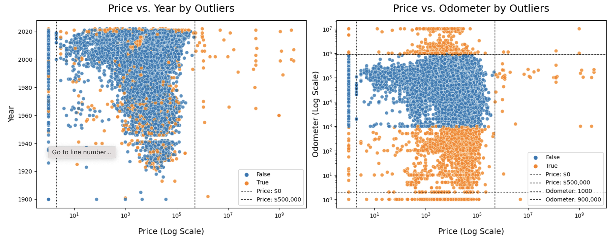

# What drives the price of a car

This data study examines a vehicle dataset and derives the features that influence the price of a car

## Description

The objective of the dataset is to comprehend the variables that impact the pricing of a car and to construct recommendation models.

## Scope

Analyze various features within the car dataset that influence the price of the car.

## Getting Started

### Dependencies

* Juypyter note book.

### Analysis

#### Data Exploration

As part of data exploration, the following activities have been undertaken:
* Checking for Missing Values
* Checking for Zero Values
* Checking for Unique Values
* Identifying Unique Identifiers
* Detecting Duplicate Records
* Identifying Outliers
  
#### Data visualziation
* Explored data visually for various features using histograms
   
* Plot outliers
  
  
#### Data Preparation
##### Data Cleaning
As part of data cleaning, the following activities have been carried out:

* Dropping Missing Year and Odometer Values
* Removing Duplicate Values
* Eliminating Outliers
* Identifying and Flagging Outliers Based on Thresholds
* Removing Outliers Based on Interquartile Range (IQR)
* Removing Outliers Based on Thresholds
* Filling Missing Values in Categorical Variables

##### Data Encoding 
The following encoding techniques were applied to the categorical variables:
* Ordinal Encoding
* One-Hot Encoding
      
##### Data Correlation          
* Calculating Feature Correlations
* Visualizing the Correlation Matrix
* Identifying the Top 20 Features with Positive and Negative Correlations
  
##### Feature Selection
An attempt was made to identify the relevant features using the following models.
* RandomForestRegressor
* RFE
  
##### PCA   
* PCA analysis was conducted on the features identified by Recursive Feature Elimination (RFE).

##### Modeling
* Creating datasets for modeling
* Model-Iteration 1:Dataset no outliers and cleaned data
	* LinearRegression
	* LinearRegression With PolynomialFeatures
	* LinearRegression With PolynomialFeatures and Ridge
* Model-Iteration 2: Encoded data with top co-related features
	* LinearRegression
* Model-Iteration 3: Encoded-data-with-top-co-related-feature-with-PCA
        * LinearRegression
  
##### Evaluation
    * Using hyperparameters to the models
    * Cross validation on the Linear models
#### Summary of Regression Model Evaluations

#### Next Steps and Recommendations
## Link to notebook

https://github.com/priyatamv/ML-Application-1/blob/main/prompt_II.ipynb

## Authors

Priyatam Veyyakula

## Version History

* 0.1
    * Initial Release

