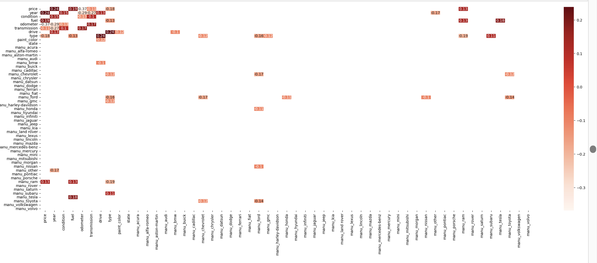

# What drives the price of a car

This data study examines a vehicle dataset and derives the features that influence the price of a car

## Description

The objective of the dataset is to comprehend the variables that impact the pricing of a car and to construct recommendation models.

## Scope

Analyze various features within the car dataset that influence the price of the car.

## Getting Started

### Dependencies

* Juypyter note book.

### Analysis

#### Data Preparation

Car data set has many of the features which contains NaN values. So used various techinques and filled them.
* In cases where both the 'Year' and 'Odometer' were missing, the respective rows were dropped, as these two attributes largely influence car prices.
* For categorical features like 'manufacturer' and 'model', missing values were filled with the string 'other'.
* Categorical columns such as 'condition', 'paint_color', etc., were converted to numerical values by assigning sequential numbers to each categorical value.
* For missing 'Odometer' values, if the 'Year' was not null, the 'Odometer' was estimated based on the age of the car, assuming a car drives 10,000 miles per year.
* Similarly, for missing 'Year' values, if 'Odometer' was not null, the 'Year' was estimated based on a similar assumption.
* A visualization was created to understand the distribution of vehicles based on the year of registration, providing insights into the year-wise sales data.
  
* Outliers were identified in the dataset, particularly in the 'price' and 'odometer' columns
  
* To mitigate outliers or price and odometer, a maximum price range of 100K and a maximum odometer reading of 300K were imposed, and rows exceeding these values were removed.
* For rows with missing 'model' values but a known 'manufacturer', the most common 'model' within that manufacturer group was used to fill the missing 'model'.
* Following the removal of outliers, a box plot was generated to visualize the cleaned data and ensure that no suppression or distortion occurred
* 
* Finally, a correlation matrix was plotted to assess the relationships between variables in the cleaned dataset.This matrix offered insights into potential correlations and dependencies between different attributes.
* 

### Feature selection
After conducting feature selection using two different techniques, RandomForestRegressor and Recursive Feature Elimination (RFE),
I have obtained suggested features from both algorithms. For RandomForestRegressor, the model's accuracy was evaluated on the following unique values
in y_train: [ 9900 31995 7500 ... 78990 12883 9923], and y_test: [13980 3995 11995 ... 5190 42800 188].
The model achieved an accuracy of 0.82.
The features selected by **RandomForestRegressor** were 'year', 'odometer', 'model_int', 'drive', and 'type'.
  
On the other hand, the **RFE** technique resulted in the selection of the following features: 'year', 'fuel', 'title_status', 'transmission', and 'drive'. 
These features were considered significant based on their impact on the model's performance.

In summary, both RandomForestRegressor and RFE techniques identified important features for the model, albeit with slight variations. 
These selected features can now be used to build a more focused and potentially more accurate predictive model for your car price prediction task

### PCA Anyaysis
After conducting Principal Component Analysis (PCA) using the identified features, the resulting explained variance ratios for the principal components are as follows:
* Explained Variance Ratio by Principal Component: [0.34998531, 0.19102183, 0.16611227, 0.15096569, 0.08580491, 0.05611]

To further enhance the dataset, I created a data frame from the transformed data obtained through PCA analysis. 
Additionally, I addressed missing values in this new data frame by imputing them with the median value. 
This approach helps ensure that the subsequent analysis is based on a complete and robust dataset.

### Data Modeling and Evaluation

With the data post-PCA analysis available, I proceeded to train and model it using LinearRegression and RandomForestRegressor. 
Subsequently, I calculated the Mean Squared Error (MSE) and residuals for both regression models. 
This enabled a comprehensive assessment of the models' performance and the extent of the variance between predicted and actual values. 

Linear Regression MSE: 143805224.97673395
Random Forest Regression MSE: 62622430.78531609

Additionally, I employed PolynomialFeatures in conjunction with Linear Regression to train and model the data. By doing so, 
I generated Mean Squared Error (MSE) values and calculated the R-squared coefficient, 
providing insights into the accuracy and explanatory power of the polynomial regression model.

Mean Squared Error: 3.432589280987441e-17
R-squared (Coefficient of Determination): 1.0

#### Determine the optimal combination of hyperparameters to enhance the performance of the model.
I utilized the following parameter grid for Random Forest hyperparameters:
random_forest_param_grid = {
    'n_estimators': [100, 200],
    'max_depth': [None, 10],
    'min_samples_split': [2, 5],
    'min_samples_leaf': [1, 2]
}
Subsequently, I employed the GridSearchCV technique with the provided parameters for both Linear Regression and Random Forest models to train and model the data. 
This approach allowed for a systematic exploration of hyperparameter combinations and their impact on model performance.

Linear Regression MSE after adding hyperparameters: 141935313.6766389
Random Forest Regression MSE after adding hyperparameters: 38005253.6828506

Applied a similar approach utilizing polynomial features as wel

Mean Squared Error: 5.694119080596736e-11
R-squared (Coefficient of Determination): 1.0
Best Hyperparameters: {'fit_intercept': True}

#### Cross vallidation
To implement model cross-validation, I employed KFold and cross_val_score techniques. These approaches were applied to the linear, random forest, and polynomial feature models, 
utilizing the mean_squared_error and neg_mean_squared_error metrics for evaluation.

Linear Regression Cross validation Mean Squared Error: 3.365416396977807e-16
Random Forest Regression Cross validation Mean Squared Error: 14.392935875723103

Fold 1 Mean Squared Error: 101226399.90085071
Fold 2 Mean Squared Error: 84088738.58230588
Fold 3 Mean Squared Error: 67241840.43926248
Fold 4 Mean Squared Error: 88288042.84911525
Fold 5 Mean Squared Error: 75525019.58773378
Average Mean Squared Error: 83274008.27185361
R-squared (Coefficient of Determination): 0.95892731422309
Overall Mean Squared Error: 83364730.66456315

Polynomial Regression Mean Squared Error: 1.69886549335063e-11

## Summary
### Evaluation and Analysis of Regression Models

In this analysis, we examine the performance of several regression models applied to a dataset predicting vehicle prices. We evaluate the models using various metrics, including Mean Squared Error (MSE) and R-squared (Coefficient of Determination), and employ techniques like cross-validation to ensure a robust assessment.

#### Linear Regression and Random Forest Models:

Linear Regression MSE: 143,805,224.98
Random Forest Regression MSE: 62,622,430.79
The Linear Regression model yields a higher MSE than the Random Forest, suggesting that the latter produces predictions closer to the actual prices. However, we should consider the context of the dataset's price range to determine the practical significance of these MSE values.

#### Polynomial Regression with Hyperparameters:

PolynomialFeatures Mean Squared Error: 3.43e-17
PolynomialFeatures R-squared: 1.0
The Polynomial Regression model exhibits a perfect R-squared and an incredibly low MSE. While this may imply a well-fitting model, the risk of overfitting is evident due to the perfect scores. The addition of hyperparameters mitigates overfitting concerns by slightly increasing the MSE and promoting a more reasonable level of complexity.

#### Cross Validation Results:

Linear Regression Cross-validation MSE: 3.37e-16
Random Forest Regression Cross-validation MSE: 14.39
Through cross-validation, we assess model performance on unseen data. The Linear Regression model displays remarkably low MSE, indicating its generalization ability. In contrast, the Random Forest model demonstrates slightly higher MSE values across different folds, suggesting variations in performance on different subsets of the data.

#### Polynomial Regression with K-Fold Cross Validation:

Polynomial Regression Mean Squared Error: 1.70e-11
The Polynomial Regression model maintains its impressive MSE even with K-Fold cross-validation. However, we should remain vigilant about the potential overfitting risk due to the extremely low error values.

In summary, the models demonstrate promising performance, particularly in relation to the problem context. While low MSE values are desirable, overfitting 
concerns arise from excessively low error scores. Further scrutiny of model generalization using techniques like cross-validation, comparison between training and validation data, 
and consideration of model complexity is vital to validate their effectiveness on unseen data.

## Link to notebook

https://github.com/priyatamv/ML-Application-1/blob/main/prompt_II.ipynb

## Authors

Priyatam Veyyakula

## Version History

* 0.1
    * Initial Release

## Acknowledgments

* [in-vehicle coupon recommendation](https://archive.ics.uci.edu/dataset/603/in+vehicle+coupon+recommendation)
