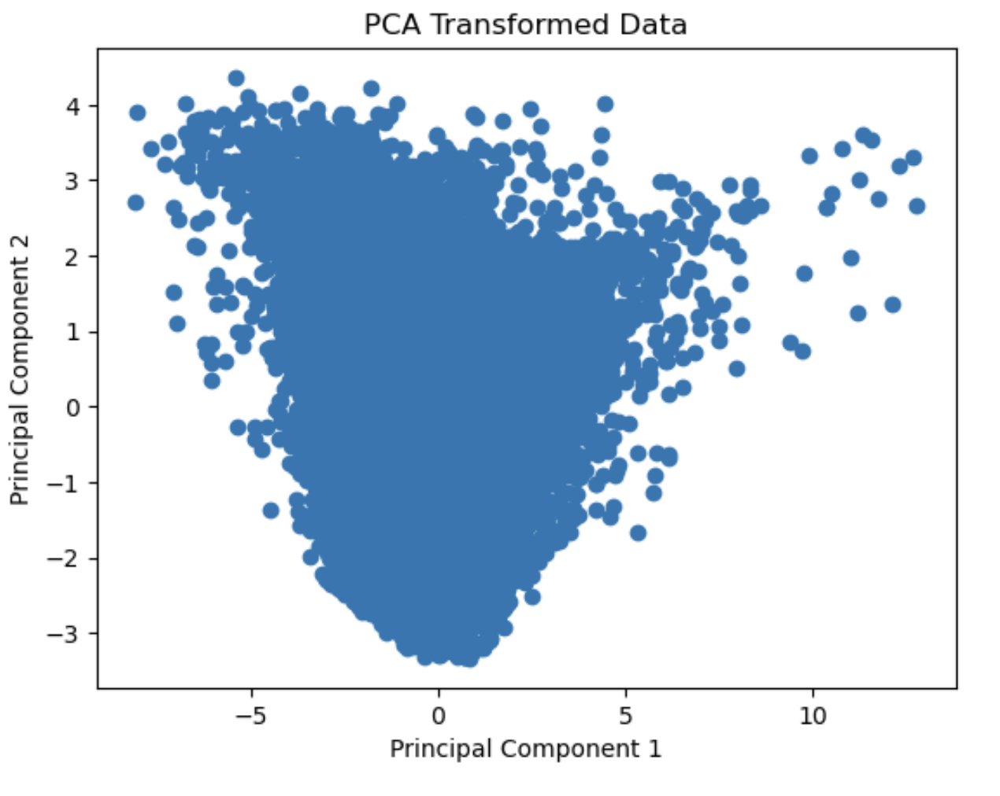

# What drives the price of a car

This data study examines a vehicle dataset and derives the features that influence the price of a car

## Description

From a business perspective, we are tasked with identifying key drivers for used car prices. In the CRISP-DM overview, we are asked to convert this business framing to a data problem definition. Using a few sentences, reframe the task as a data task with the appropriate technical vocabulary.

## Scope

Analyze various features within the car dataset that influence the price of the car.

## Getting Started

The objective of this assingment is find the variables that impact the pricing of a car and to construct recommendation models.

### Dependencies

* Juypyter note book.

### Analysis

Every model adheres to the fundamental principles of the CRISP-DM Framework, encompassing five key pillars

* Business understanding
* Data understanding
* Data preparation
* Modeling
* Evaluation

#### Data Exploration

As part of data exploration, the following activities have been undertaken:
* Checking for Missing Values
* Checking for Zero Values
* Checking for Unique Values
* Identifying Unique Identifiers
* Detecting Duplicate Records
* Identifying Outliers
  
#### Data visualziation
* Explored data visually for various features using histograms
   
* Plot outliers
  
  
#### Data Preparation
##### Data Cleaning
As part of data cleaning, the following activities have been carried out:

* Dropping Missing Year and Odometer Values
* Removing Duplicate Values
* Eliminating Outliers
* Identifying and Flagging Outliers Based on Thresholds
* Removing Outliers Based on Interquartile Range (IQR)
* Removing Outliers Based on Thresholds
* Filling Missing Values in Categorical Variables
* Plot outliers after cleaning data
  
* Data distribution after cleaning
  

##### Data Encoding 
The following encoding techniques were applied to the categorical variables:
* Ordinal Encoding
* One-Hot Encoding
      
##### Data Correlation          
* Calculating Feature Correlations
* Visualizing the Correlation Matrix
* Identifying the Top 20 Features with Positive and Negative Correlations
  
##### Feature Selection
An attempt was made to identify the relevant features using the following models.
* RandomForestRegressor
* RFE
  
##### PCA   
* PCA analysis was conducted on the features identified by Recursive Feature Elimination (RFE).
   
   

##### Modeling
* Creating datasets for modeling
* Model-Iteration 1:Dataset no outliers and cleaned data
	* LinearRegression
	* LinearRegression With PolynomialFeatures
	* LinearRegression With PolynomialFeatures and Ridge
* Model-Iteration 2: Encoded data with top co-related features
	* LinearRegression
* Model-Iteration 3: Encoded-data-with-top-co-related-feature-with-PCA
        * LinearRegression
  
##### Evaluation
* Using hyperparameters to the models
* Cross validation on the Linear models
    
## Summary of Regression Model Evaluations

### Default Linear Regression Model

- Y Test Mean Squared Error: 137664800.45
- Y Train Mean Squared Error: 140088053.16
- R-squared (Coefficient of Determination): 0.3074

### Linear Regression Model with Added Hyperparameters

- Hyperparameters added: `fit_intercept` [True, False]
- Y Test Mean Squared Error: 137664800.45
- Y Train Mean Squared Error: 140088053.16
- R-squared (Coefficient of Determination): 0.3074

### Linear Regression Model with Polynomial Features

- Y Test Mean Squared Error: 148821749.58
- Y Train Mean Squared Error: 150774593.47
- R-squared (Coefficient of Determination): 0.2513

### Linear Regression Model with Polynomial Features and Hyperparameters

- Best Model:
  - Y Test Mean Squared Error: 125658310.88
  - Y Train Mean Squared Error: 122584067.09
  - R-squared (Coefficient of Determination): 0.3678

### Linear Regression Cross Validation

- Mean Squared Error (X1): 151296699.11
- Cross-validation with K-fold:
  - Fold 1 Mean Squared Error: 176142012.73
  - Fold 2 Mean Squared Error: 145507844.94
  - Fold 3 Mean Squared Error: 123455404.45
  - Fold 4 Mean Squared Error: 153142905.78
  - Fold 5 Mean Squared Error: 158235327.64
- Average Mean Squared Error: 151296699.11
- R-squared (Coefficient of Determination): 0.2578

### Principal Component Analysis (PCA) Model

- Explained Variance Ratios by Principal Component:
  - PC1: 0.2795
  - PC2: 0.2231
  - PC3: 0.1560
  - PC4: 0.1379
  - PC5: 0.1135
  - PC6: 0.0901
- Y Test Mean Squared Error: 3.236e-22
- Y Train Mean Squared Error: 3.259e-22
- R-squared (Coefficient of Determination): 1.0

#### Next Steps and Recommendations

#### Tackling Overfitting: 
For the PolynomialFeatures model, consider fine-tuning polynomial degrees and regularization to mitigate overfitting.

#### Feature Exploration: 
Continue exploring and engineering features that could bolster model performance.

#### Ensemble Approaches: 
Delve into ensemble models like Gradient Boosting or XGBoost for enhanced predictive capabilities.

#### Hyperparameter Refinement: 
Persistently refine hyperparameters while validating against unseen data for optimal generalization.

#### Domain Expertise: 
Leverage domain knowledge to guide feature selection and model interpretation.

#### Residual Analysis: 
Probe into residuals to uncover underlying trends or patterns that models may not capture accurately.

#### Data Quality and Quantity: 
Assess data quality and consider augmenting the dataset to bolster model efficacy.

#### Interpretation: 
Interpret model results in context and validate against real-world insights.

## Link to notebook

https://github.com/priyatamv/ML-Application-1/blob/main/prompt_II.ipynb

## Authors

Priyatam Veyyakula

## Version History

* 0.1
    * Initial Release

